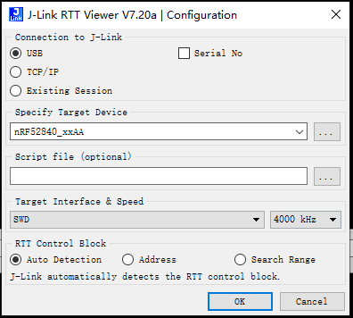
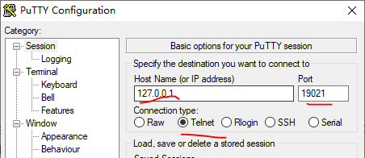
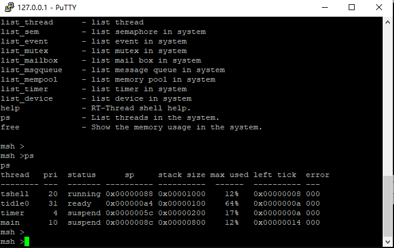
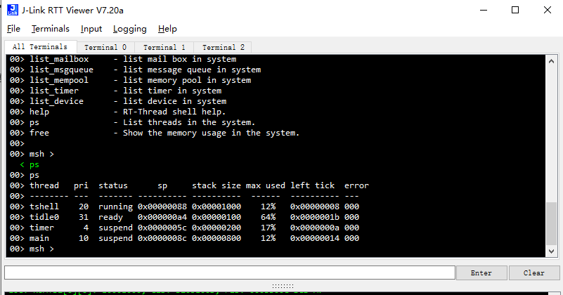
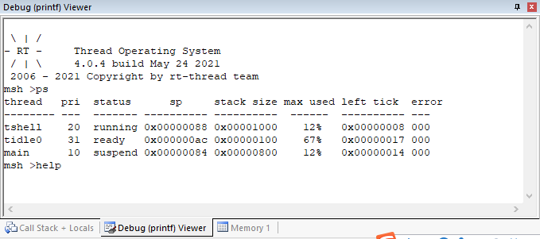
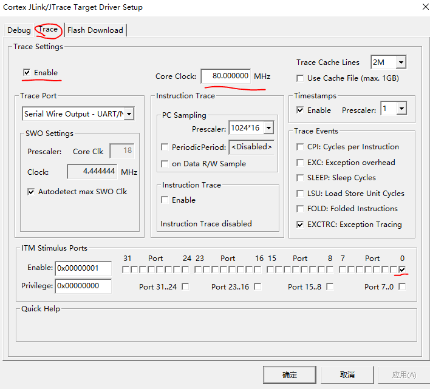
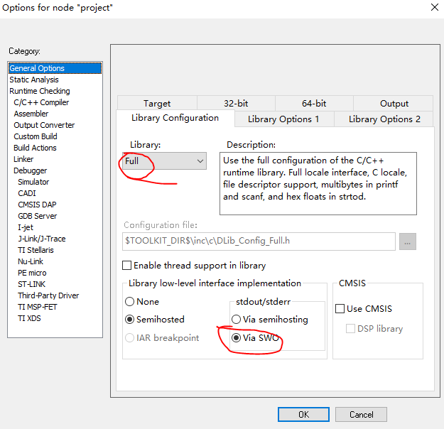
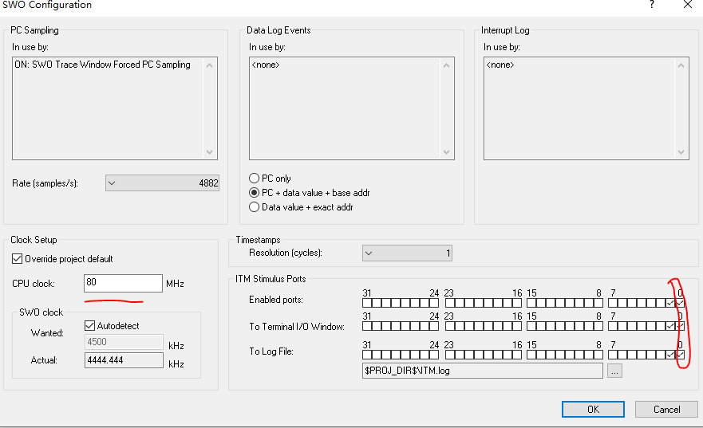
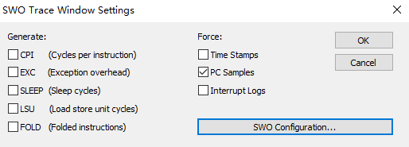

# RTTHREAD_SEGGER_TOOL

## Introduce

这个软件包主要将JLINK作为RTT 的console口来使用，能够节省一些设备的UART资源。该软件包必须依赖于JLINK之上的，手上必须要有JLINK相关的硬件调试器才能使用。

SEGGER_RTT有以下几个特点:

- 可以在中断中打印
- 可以缓存开机的log
- 可以接收命令
- 多平台支持
- 不依赖操作系统，单机裸机都可以运行SEGGER_printf

## 如何使用

drv_rtt.c 相当于多了一个UART串口device设备，如果你想要代替console的话，需要做如下修改

- rt_hw_jlink_rtt_init 初始化必须在`rt_console_set_device(RT_CONSOLE_DEVICE_NAME);` 之前调用

- rtconfig中的console也要设置为`jlinkRtt`

```
#define RT_CONSOLE_DEVICE_NAME "jlinkRtt"
```

实现这两点，基本可以将console设置为segger_rtt

### JLINK_RTT_VIEWER配置

根据你当前的芯片以及JTAG还是SWD来选择



这边需要注意的是最下面的地址，指的是代码中&_SEGGER_RTT的地址，有些芯片支持自动识别地址，有些芯片不支持自动识别地址。可以设置search 范围

```
0x20000000 0x1000
```

### SEGGER_RTT 地址

segger_rtt的地址，这边通过修改代码，将地址默认设置在0x20000000上面，目前只支持KEIL这样做，后面会支持其他的，其他编译器debug的时候看下_SEGGER_RTT变量的地址。

```
SEGGER_RTT_PUT_CB_SECTION(SEGGER_RTT_CB_ALIGN(SEGGER_RTT_CB _SEGGER_RTT))__attribute__((section(".ARM.__at_0x20000000")));
```

## 高级使用技巧

可以在RTT viewer 连上之后，打开putty

配置如下：





也可以在RTT_VIEWER里面输入，putty和VIEWER只能用一种。输入Enter或者回车可以输入命令




## 注意事项

1. 你需要有JLINK连接。 在STM32或者nordic开发板上测试都是可以用的。其他的JLINK应该也是通用的，这个省去了调试的UART串口的占用。可以用这个口打印log或者console调试。当前前提是得有JLINK相应的硬件。

2. 只要你的开发板可以用JLINK来调试查看变量，就可以用这个软件包。
RTT本质上，就是一直轮询_SEGGER_RTT这个全局变量。所以对架构不是特别敏感，只要你的板子JLINK可以debug即可。

3. 如果你手上有STLINK， 可以选择刷成JLINK  参考连接[segger st-link](https://www.segger.com/products/debug-probes/j-link/models/other-j-links/st-link-on-board/)
当然刷成JLINK之后，你的JLINK也只能操作STM32授权的设备，其他厂商设备是不支持的。


## 结语

这个是初步版本，如果有什么值得改进，或者建议，可以提issue或者直接PR。都是欢迎大家的。


# SWO的使用

SWO 的使用方法更加简单，原理和RTT一样，而且也可以实现TX RX。我之前一直以为，SWO只有要一根线，只能实现TX， 后来觉得有些奇怪，就查了下相关资料。发现也是可以实现RX的。那也就可以替代串口的console了。如下图所示。



SWO的打印有以下几种方式，通常IDE一般都有支持：

- KEIL debug(printf)打印 (可以实现TX RX)
- IAR Terminal IO 打印 （可以实现TX RX)
- JLINK SWO VIEWER （只能显示， 只能用于J-LINK）
- ST-LINK SERIAL WIRE VIEWER （只能显示，只能用于ST-LINK）

SWO 使用了ITM模块

## keil的使用方法

keil中可以通过设置DEBUG来配置



设置完了之后，端口0就可以用了，如果使用其他端口，需要修改tx函数。debug的时候，打开debug(printf)的窗口，即可使用，这边要设置时钟和MCU中的时钟要一致，端口默认选择port0。

如果要实现console功能，如上面一开始讲到的一样

- rt_hw_swo_init初始化必须在`rt_console_set_device(RT_CONSOLE_DEVICE_NAME);` 之前调用

- rtconfig中的console也要设置为`SWO`

## IAR使用方法

打开SWO









