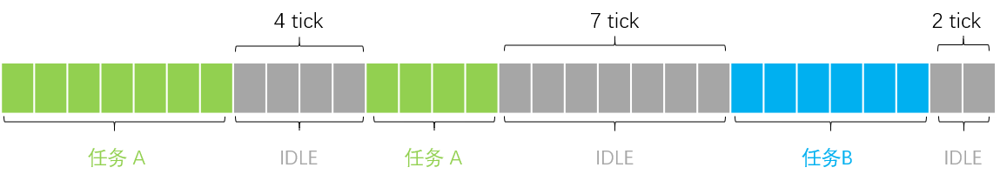

# CPU 使用率统计

统计单核 CPU 使用率。目前不支持多核

## 基本原理

每个时间片侦测一次当前线程，如果当前正在运行 idle 线程，空闲计数器自增。一个周期后，计算 IDEL 线程运行时间的占比。

例如：



上图展示一个周期内，某个 CPU 上线程时间片信息。假设一个方格代表一个时间片。

- 一个周期总时间片数 `30 tick`
- idle 总共运行 `13 tick`

CPU 使用率 = 13 / 30 * 100

## 使用方法

### 代码调用

```c
float load;
cpu_usage_init();
load = cpu_load_average();
printf("cpu load average: %f\n", load);
```

### 命令行

msh 命令行输入 `usage` 打印出 CPU 使用率

```sh
msh />usage
cpu: 31
```

msh 命令行输入 `usage -l 50`，调整 CPU 使用率，使其不低于 50%

```sh
msh />usage -l 50
CPU usage adjusted to 50%
msh />usage
cpu: 51
```

> 若系统没有使用自动初始化功能，在输出命令之前，主动调用 `cpu_usage_init` 进行初始化。

## API 介绍

[API 介绍](./API.md)
