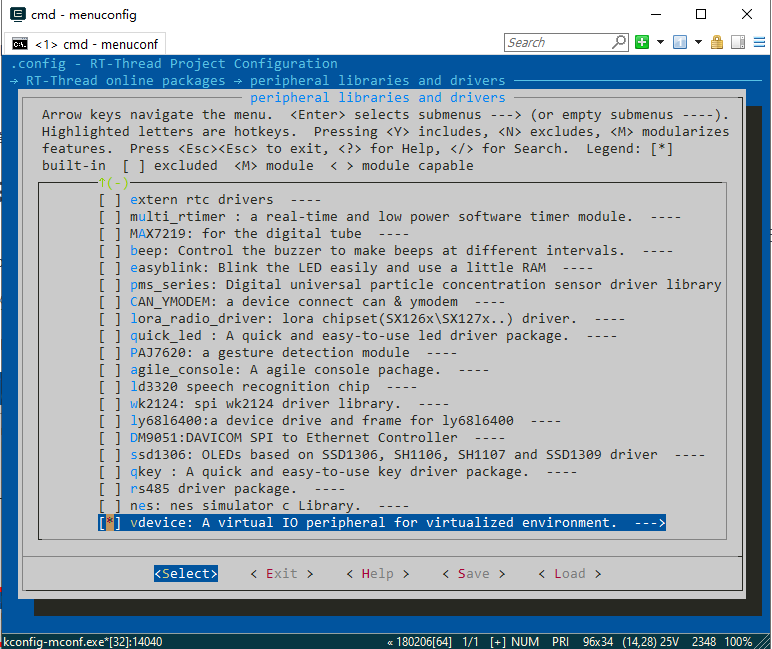
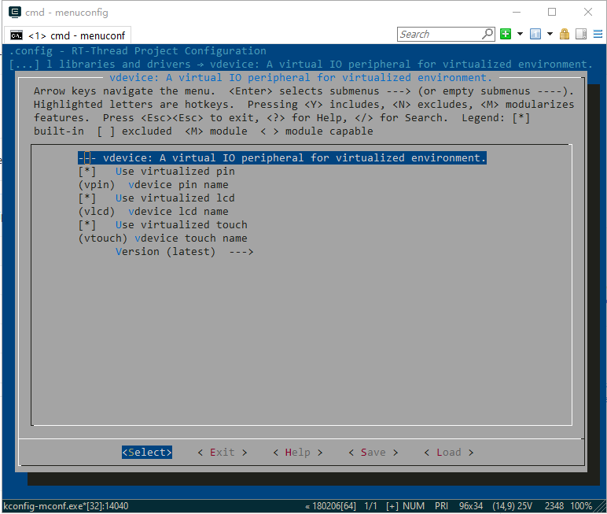

# vdevice
基于 rt-thread device 框架的虚拟 IO 设备

## 虚拟IO列表

| 设备     | 描述            |
| -------- | --------------- |
| vgpio.c  | 虚拟 GPIO 设备  |
| vlcd.c   | 虚拟 LCD 设备   |
| vtouch.c | 虚拟 TOUCH 设备 |

## 使用说明

- 使用 menuconfig 使能 vdevice。
- 选择需要虚拟化的设备。





## 维护地址

```
https://github.com/stackRyan/vdevice
yuanjyjyj@163.com
```

