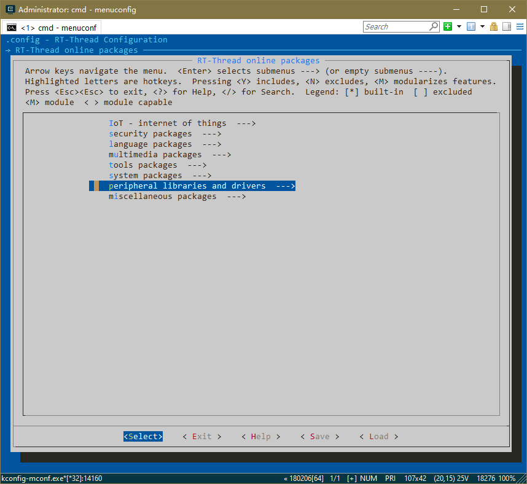
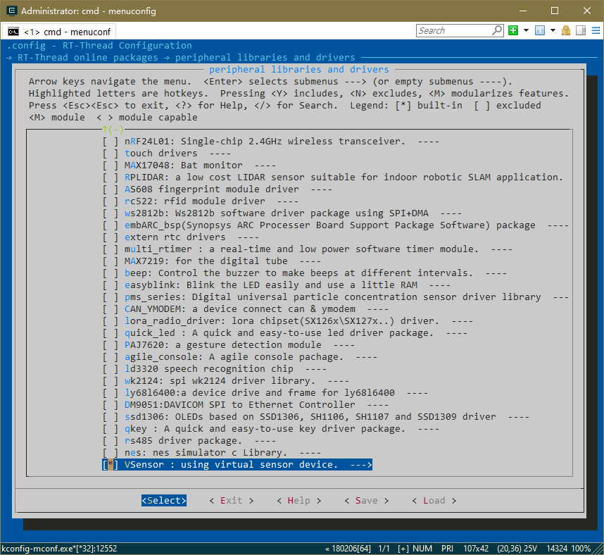
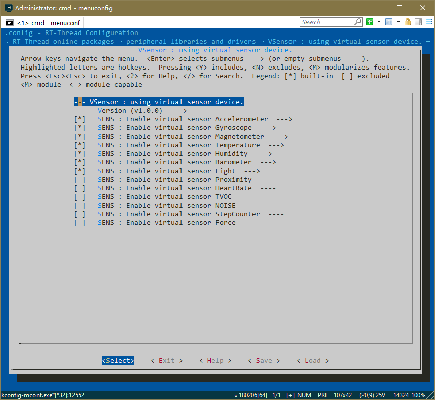

# vsensor

rt-thread虚拟传感器，基于RT-Thread Sensor框架，模拟传感器设备基本的功能。

## 传感器列表


| 编号 | 传感器名称    | 备注         |
| ---- | ------------- | ------------ |
| 1    | Accelerometer | 加速度传感器 |
| 2    | Gyroscope     | 陀螺仪       |
| 3    | Magnetometer  | 磁传感器     |
| 4    | Temperature   | 温度传感器   |
| 5    | Humidity      | 湿度传感器   |
| 6    | Barometer     | 气压计       |
| 7    | Light         | 光感         |
| 8    | Proximity     | 距离传感器   |
| 9    | HeartRate     | 心率传感器   |
| 10   | TVOC          | 血氧         |
| 11   | Noise         | 噪声传感器   |
| 12   | StepCounter   | 计步传感器   |
| 13   | Force         | 力传感器     |


## 使用说明

* 通过menuconfig，使能虚拟传感器
* 使能单个或多个传感器








## 维护地址
```c
https://github.com/RT-Thread-packages/vsensor.git
RT-Thread 团队
```

