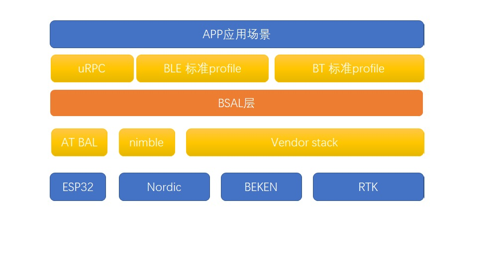

# RT-Thread BSAL软件包介绍及移植指南

## 1.  BSAL 软件包介绍

BSAL （Bluetooth Stack Abstract Layer）软件包是由 RT-Thread 针对不同 蓝牙协议栈接口实现的，目前支持的 协议栈有：nimble，realtek等协议栈 。

### 1.1 背景介绍

Bluetooth Stack Abstract Layer 蓝牙协议栈抽象层。用于适配各家协议栈以及底层卡片。

主要在协议栈基础之上封装一层抽象层接口。

#### 1.1.1 具体问题介绍

- 各家厂商都有自己独有的协议栈，协议栈接口之间不通用。
- 根据SIG标准的profile，各家都基于自家协议栈实现代码，工作量比较大而不通用。
- 基于ble profile的代码，大部分厂家的代码都是开放的。
- BLE GATT的操作比较统一，适合整合成一套统一的接口。
- GAP抽象接口行为一致，但各家接口都不统一
- 各家的profile和ble相关的app代码只能适配自家代码
- 基于开源协议栈的接口，也不够通用

基于这些问题，我们推出BSAL层接口，为了兼容多家MCU的协议栈和方便后续拓展性。

### 1.2 应用场景

#### 1.2.1 应用场景框架

针对该接口的使用场景，总结出以下几个应用场景：

- 点对点自定义协议栈蓝牙GATT透传自定义协议（这种profile自定义，只需要数据传输过去即可,完成数据收发）通常作为service端。
- 基于BLE 标准PROFILE的SIG sample(比如：心率计（HRS）, HID设备（HOGP), 设备信息（DIS)，电池服务（BAS)通常作为service端， central端比较少，通常central为手机。
- 基于PB-ADV的MESH协议栈，通常作为broadcaster， observer
- blufi 配网 对于特定的带有WIFI模块的芯片
- MCU + BT SOC通信调用，BT SOC作为BSAL层的执行端，MCU作为BSAL的发起端

#### 1.2.2 应用产品

基于上面的API，可以开发出对应的蓝牙应用产品：

- 电子名片（可以用于手机编辑，以及WIFI配网，IOT控制LED小灯等操作）
- 手机微信小程序控制小车（作为遥控器，控制带有ble的小车系统），作为一个遥控器来控制，可以不用依赖红外那种指向性的，比WIFI省电。
- 蓝牙遥控器。手机小程序有遥控器界面，来控制带有USB设备的电脑，电视以及等等设备，用蓝牙模拟HID设备。解决的痛点主要是经常遥控器断电，遥控器找不到了。
- 蓝牙小键盘。带USB的两颗蓝牙卡片，一个做成小键盘，一个做成USB HID device
- 蓝牙pos机，基于自定义透传协议。
- 阿里mesh智能家居小灯等设备。
- micropython对应的python ubluetooth应用。
- MCU + BT_soc 轻量级的控制的场景
- 智能穿戴BLE操作，后续会考虑支持BR/EDR的接口操作
- 智能音响，mesh，A2DP，HFP，ble
- 自行车码表

### 1.3 软件包的介绍

BSAL作为一层通用层，隔开app和stack之间的接口。因为要尽量兼容各家协议栈的不同类型的接口，所以需要一些额外的开支。当然这个可以在进一步的迭代过程中逐步优化。

#### 1.3.1 框架介绍



#### 1.3.2 主要功能介绍

##### 1.3.2.1 适配性

可以适配大部分的厂商的蓝牙协议栈接口，如果接口不适配，也有冗余接口进行拓展适配。

当然如果没有协议栈，可以使用nimble+RTT的方式进行HCI 层对接适配，也是可以使用BSAL上层的接口的。

##### 1.3.2.2 可移植性

可以方便移植到不同平台，BSAL层尽量做到能适配大部分的BLE STACK平台，只做上层逻辑的接口的优化和实现，并不针对某个特定的硬件或者协议栈。

#### 1.3.3 目录结构

BSAL目录结构：

```
├───docs                      // 相关文档
├───inc                       // 组件头文件
│    ├───bsal.h               // bsal总头文件
│    ├───bsal_app_api.h       // bsalAPP和profile需要调的API接口
│    ├───bsal_common.h        // bsal通用结构体定义
│    ├───bsal_int.h           // bsal移植协议栈需要了解的接口
│    ├───bsal_sig.h           // bsal中根据SIG规定的接口和标准值
│    ├───bsal_stack_api.h     // bsal协议栈接口API
│    └───bsal_osif.h          // bsal调用到的OS相关的接口
├───port                      // 移植适配文件
│    ├───empty_stack          // 空协议栈平台（给第一次移植需要使用的空模板）
│    ├───realtek              // REALTEK协议栈适配文件
│    └───nimble               // NIMBLE协议栈适配源文件
├───src     
│    └───bsal.c               //将stack接口封装一层，供profile调用
├───profile                   // 各种 蓝牙 profile 文件
│    ├───client               // profile作为主机端的操作源文件
│    ├───service              // profile作为service端的操作源文件
│        ├───basl_bas         // battery service 源文件头文件
│              ├───bsal_srv_bas.h    // bas service 头文件
│              └───bsal_srv_bas.c    // bas service 源文件
│        ├───bsal_blufi              // blufi 蓝牙wifi配网
│              ├───bsal_srv_blufi.h    // bas service 头文件
│              └───bsal_srv_blufi.c    // bas service 源文件
├───sample    
│    ├───ble_bas_only_app.c   // 只有battery servcie的源文件
│    └───ble_bas_blufi_app.c  // 带有bas和blufi两个profile的源文件
├───README.md                 //
└───SConscript                //软件包scons脚本
```


#### 1.3.4 配置选项

BSAL 组件配置：

```
[*] BSAL: The Bluetooth Stack Abstract Layer 
[ ] Bluetooth Role support --->                         // BLE 支持角色
[*]      Peripheral role             // perpheral 角色
[ ]      Central Role                // central 角色
[ ]      Broadcaster Role            // broadcaster 角色
[ ]      Observer Role               // Observer role
(1)     The maximum link of supported ble link          // BLE 最大link数
[ ]     Bluetooth sample ---->                          // sample
[ ]                 BLE peripheral                      
[ ]                   ble battery service sample        // ble battery service sample
[ ]                   ble bluefi sample                 // ble 配网 sample
[ ] BSAL STACK SELECT--->                               // 单选
            ()         RTK                              // 支持realtek的协议栈
            ()         Nordic softdevice                // 支持nordic的协议栈
            ()         NIMBLE                           // 支持nimble开源协议栈
```

配置选项可以选择不同协议栈、不同profile service的支持，以及角色的支持

#### 1.3.5 API接口介绍

API接口主要分为两部分，一部分对于用户来讲，写APP和profile需要知道的接口。还有一部分对于协议栈和蓝牙卡片来讲，需要实现的接口。

##### 1.3.5.1 APP用户接口介绍

对于 用户APP和profile来言，需要了解协议栈初始化接口，以及

````c
//1. STACK API  应用层调用
/* stack 根据name 找到stack指针*/
void *bsal_find_stack_ptr(char *stack_name);

/* stack 初始化，并注册协议栈的callback函数 */
int bsal_stack_init(void *stack_ptr, void *callback);

/* stack 开始注册profile service ， 并注册通用profile的回调函数*/
void bsal_stack_le_srv_begin(void *stack_ptr, uint8_t num, void *p_fun_cb);

/* stack 结束注册profile service*/
void bsal_stack_le_srv_end(void *stack_ptr);

/* stack 开始运行*/
void bsal_stack_startup(void *stack_ptr);

//2. SERVICE API
/* profile 注册自己的service table，并注册回调函数*/
typedef BSAL_STATUS(*P_SRV_GENERAL_CB)(void *p_para);
int  bsal_stack_le_srv_reg_func(void *stack_ptr, void *srv_def, P_SRV_GENERAL_CB *callback);

//3. SERVICE SEND DATA
/* service 发送NOTIFY数据 */
int bsal_srv_send_notify_data(void *stack_ptr, uint16_t conn_id, uint16_t service_id, uint16_t offset_handle, uint16_t value_length, uint8_t *value);

int bsal_srv_send_ind_data(void *stack_ptr, uint16_t conn_id, uint16_t service_id, uint16_t offset_handle, uint16_t value_length, uint8_t *value);

````

#### 1.3.6 使用说明（BLE 流程 for APP）

##### 1.3.6.1 广播使用流程

对于peripheral而言，首先需要打广播

广播样例代码如下：

```c
//1. 申请一个32byte的数组，用于存放广播内容
uint8_t tmp_data[32] = {0} ; //must be zero
//2. 添加广播中的flag
bsal_le_adv_data_add_flag(tmp_data, BSAL_GAP_ADTYPE_FLAGS_LIMITED | BSAL_GAP_ADTYPE_FLAGS_BREDR_NOT_SUPPORTED);
//3. 添加广播中的名字
char *adv_name = "rtt_ble";
bsal_adv_data_add_name(tmp_data, strlen(adv_name), adv_name);
//4. 添加广播中的服务内容
bsal_adv_data_add_uuid16(tmp_data, BSAL_GATT_SERVICE_BATTERY_SERVICE);
//5. 设置广播内容
bsal_set_le_adv_data_user(stack_ptr, tmp_data);
//6. 开始广播
bsal_stack_start_adv(stack_ptr);
```

##### 1.3.6.2 profile service 的TX RX使用流程

了解TX RX需要知道一个相对handle和绝对handle。

绝对handle是该ATT在整个project中的绝对地址，BSAL存储的是绝对地址，该地址是惟一的。profile处理的是相对handle，该handle是相对于profile的相对偏移，off_handle就是相对偏移，u_handle就是绝对偏移，

只要保证u_handle唯一即可，这个需要根据 协议栈的callback的接口来定位。

-  service READ REQUEST操作

手机或者central给service 发送READ 数据的时候，以nimble为例

原生stack先唤醒nimble中的回调函数：

```
nimble_chrs[x].access_cb = bsal_ble_svc_bas_access;
```

bsal_ble_svc_bas_access这个函数处理的事件：

BLE_GATT_ACCESS_OP_READ_CHR:

这个时候，先从bsal_srv_objs service table中找到回调函数，然后先通知到profile层。

profile对数据进行解析之后，判断是否要通知APP层，对端来读取数据，如果觉得不需要通知，直接返回对应的值即可。

PROFILE如果对于某个值需要进行更新，调用BSAL提供的接口：

```
//这个接口主要讲数据值写入到att数据库中，方便BSAL读取该值返回给STACK
int bsal_srv_write_data(void *stack_ptr, uint16_t start_handle, uint16_t offset_handle, uint16_t value_length, uint8_t *value);
```

- service WRITE requst/cmd 操作

手机或者central要给service 写入某个值的时候，以nimble为例：

根据callback中的BLE_GATT_ACCESS_OP_WRITE_CHR事件，由STACK回调上来，
这个时候，先从bsal_srv_objs service table中找到回调函数，然后先通知到profile层。

PROFILE如果需要存储该值，做对应的处理即可，自行选择什么时候通知上层APP。

write 本质上并没有长度上的限制，由profile决定数据该如何处理即可。

- service notify 操作

service 如果想要主动给client端发数据，client端必须先打开CCCD。 并且service 中的该character需要有notify这个属性。主要打开，service 才可以发数据给client端。

发送调用接口：

```
int bsal_srv_send_notify_data(void *stack_ptr, uint16_t conn_id, uint16_t start_handle, uint16_t offset_handle, uint16_t value_length, uint8_t *value);
```

### 1.4 软件包的使用

可以选择不同的 sample 做对应的 app 应用开发

## 2. 移植指南

### 2.1 STACK 移植接口介绍：

先介绍下协议栈 object 指针内容：

```c
struct bsal_stack_obj
{
   /* stack 是否 ready */
    bool                       stack_ready_flag;
    /* stack 主要 OP 操作 */
    bsal_stack_ops_t           bsal_ops;
    /* att 数据库 */
    bsal_gatt_value_entry_t   *db;
    /* service profile 的数据库，存放 profile 的callback */
    bsal_srv_callback_t       *bsal_srv_objs;

    /* 存放 static 临时信息: */
    bsal_stack_info_t          bsal_info;
    /* gatt index 的handle的全局变量 */
    uint16_t                   g_att_index;
    /* 注册的profile的数量 */
    uint8_t                    srv_num;
    /* 存放APP注册的stack的回调函数 */
    void (*app_all_callbak)(void *stack_ptr, uint8_t cb_layer, uint16_t cb_sub_event, uint8_t value_length , void *value);
};
```

这个结构体是贯穿整个BSAL api体系的指针接口。

协议栈主要需要实现的接口是bsal_ops里面的接口，如下所示：

```c
struct bsal_stack_ops
{
    /* 设置LE 协议栈的参数 （预留，暂时不用实现） */
    BSAL_STATUS(*le_set_stack_param)(uint32_t value_length, uint8_t *value);         
    /* 获取LE 协议栈的参数 （预留，暂时不用实现） */
    BSAL_STATUS(*le_get_stack_param)(uint32_t value_length, uint8_t *value);       
    /* 获取MAC 地址 */
    void (*get_mac_address)(uint8_t addr_type, uint8_t *bd_addr);                             /* 协议栈初始化 */
    void (*init)(uint8_t stack_type);                                                         /* 协议栈启动 */
    void (*startup)(void);                                                                   /* 设置bond 相关参数*/
    void (*set_bond_param)(bsal_bond_param_t *value);             
    /* 获取bond相关的参数*/
    void (*get_bond_param)(bsal_bond_param_t *value);
    /*设置广播 相关参数*/
    void (*le_set_adv_param)(bsal_adv_param_t *adv_param);              
    /* 获取广播 相关参数*/
    void (*le_get_adv_param)(bsal_adv_param_t *adv_param);
    /* 开始广播 */
    BSAL_STATUS(*le_adv_enable)(bool enable);                           
    /* 设置GAPS层的参数 */
    void (*set_gaps_param)(bsal_gaps_param_t *gaps_param);
    
    /* 对于service提供的接口*/
    /* 从相对的service id和offset_handle转换成绝对的唯一的handle*/
    uint32_t (*cov_handle_to_u_handle)(uint16_t service_id, uint16_t offset_handle);         /* 开始注册service */
    BSAL_STATUS(*le_srv_reg_begin)(bool is_continue, uint8_t service_num, void *p_func);
    /* 注册service table*/
    BSAL_STATUS(*le_srv_reg_fun)(struct bsal_gatt_app_srv_def *p_srv, void *p_func);   
    /* 结束注册service */
    BSAL_STATUS(*le_srv_reg_end)(void);
    /* servcie发送数据 */
    BSAL_STATUS(*le_srv_send_data)(uint16_t conn_handle, uint16_t service_id, uint16_t offse_handle, uint16_t value_len, const uint8_t *value, uint8_t send_type);
    /* service 发送数据完成 (预留)*/
    BSAL_STATUS(*send_notify_complete)(uint32_t credits);   /*TODO*/
};
```

这边预留的接口比较多，需要实现的接口如下面介绍的接口，下面接口是必须要实现的，并且要优先实现的，其他接口可以慢慢实现。

- init： 这个完成协议栈的初始化自身的初始化
- startup: 这个接口实现协议栈开始启动的函数
- le_srv_send_data： service 端给client端notify数据或者indicate数据。

优先实现上述接口。

其他接口可以按照下面的移植流程中的步骤，慢慢理解实现。

需要提醒的是：对于STACK内部移植，需要了解BLE里面的GATT基本原理，需要有比较详细的了解。

### 2.2 移植流程

以nimble的移植为例 。

#### 2.2.1 步骤一  建工程

先找一个nimble的最简单的，带有battery service 一个profile操作的工程，确保手机可以搜索到battery service。并且可以连接上。最好这个工程能有RTT的支持，

以nimble+nrf52840的工程为例

#### 2.2.2 步骤二 加入 BSAL 移植框架，编译通过

从RTT软件包里面选中BSAL软件包。


scons 加入 empty_stack ，里面的协议栈相关的函数都已经注释掉了，编译通过。

#### 2.2.3 步骤三 实现 init startup

先实现ops 中的 init 和 startup 函数，确保协议栈在BSAL上面初始化和启动正常；

- init ：调用移植协议栈的初始化函数。（包含协议栈参数设置，广播参数，bas service 注册）
- startup:  启动协议栈的函数。

#### 2.2.4 步骤四 实现TX RX流程

**功能实现**

首先用原始service 的service table和adv enable

- 将 gap callback 的函数放到BSAL里面
- bas service 注册的时候，把APP的callback 通过接口bsal_profile_insert注册到BSAL数据库中
- 在nimble的READ回调函数中，根据handle来调用对应service的回调函数bsal_srv_fn_cb
- 在nimble的WRITE 回调中，掉对应的service的回调函数bsal_srv_fn_cb通知service

完成可以read write notify等接口即可。（确保数据可以根据handle来传输即可）

**功能验证**

用手机nrf connect  验证TX RX

【图片】

#### 2.2.5 步骤四 转换profile table

**功能实现**

将BSAL定义的BAS TABLE数组接口：

```c
    struct bsal_gatt_app_srv_def ble_svc_bas_defs[] =
    {
        {
            /*** Battery Service. */
            .type = BSAL_GATT_UUID_PRIMARY_SERVICE,
            .uuid = BSAL_UUID16_DECLARE(GATT_UUID_BATTERY),//(bsal_uuid_any_t *)&battery_srv,//BSAL_UUID16_DECLARE(GATT_UUID_BATTERY),
            .characteristics = (bsal_gatt_chr_def_t[])
            {
                {
                    /*** Battery level characteristic */
                    .uuid = BSAL_UUID16_DECLARE(GATT_UUID_CHAR_BAS_LEVEL),//(bsal_uuid_any_t *)&bas_char_bas_level,//BSAL_UUID16_DECLARE(GATT_UUID_CHAR_BAS_LEVEL),
                    .properties = BSAL_ATT_P_READ
                    | BSAL_ATT_P_NOTIFY
                    ,
                    .permission = GATT_PERM_READ,
                    .value_length = 1,
                },
                {
                    0, /* No more characteristics in this service. */
                }
            },
        },

        {
            0, /* No more services. */
        },
    };
```

想办法转换成nimble可以识别的接口。

在函数le_srv_reg_fun中实现对应的service功能。

这一步纯粹是本地代码的转换工作，确保BSAL注册的service 转换成nimble对应的service 注册进去，能够将ATT的属性等信息完全相同即可。

**功能验证**

先用bas service 验证，

后面用blufi service 功能验证

#### 2.2.5 步骤五 完善广播等其他接口

这一步也是纯粹代码的转换工作，主要是将广播数据（小于32byte）设置到协议栈中去，至于如何转换，根据协议栈的接口来调用相应的接口即可。

